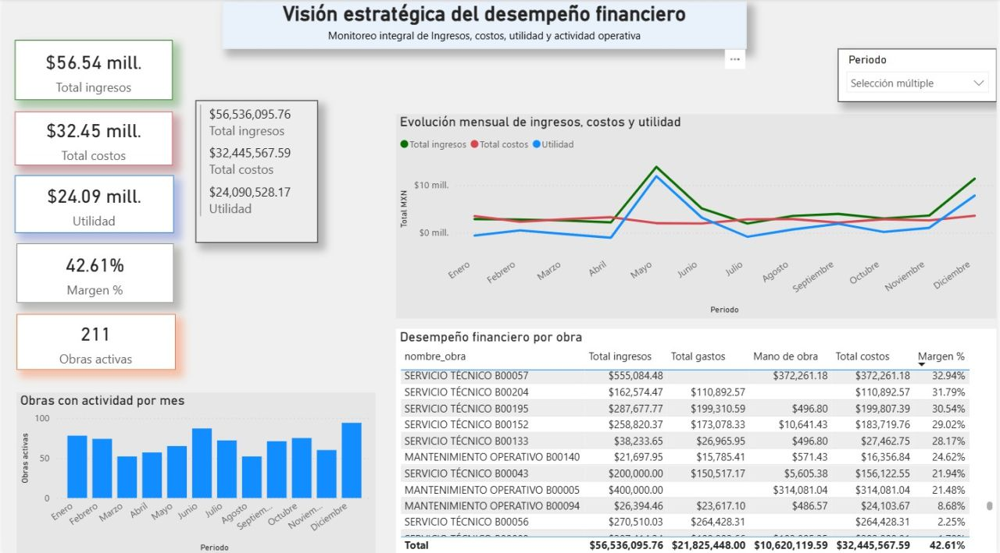

<!--
**IvanMontes7/IvanMontes7** is a ✨ _special_ ✨ repository because its `README.md` (this file) appears on your GitHub profile.
Here are some ideas to get you started:

- 🔭 I’m currently working on ...
- 🌱 I’m currently learning ...
- 👯 I’m looking to collaborate on ...
- 🤔 I’m looking for help with ...
- 💬 Ask me about ...
- 📫 How to reach me: ...
- 😄 Pronouns: ...
- ⚡ Fun fact: ...
-->

#### Acerca de mi
Data Engineer Jr | Business Intelligence | Ingeniero en Control y Automatización
---

Ingeniero en Control y Automatización con experiencia en optimización de procesos y análisis de información para la toma de decisiones. Actualmente enfocado en Ingeniería de Datos y Business Intelligence, desarrollando soluciones end-to-end que integran ETL, Data Warehousing, modelado analítico y visualización de datos.

#### Tecnologías
---

---

### Actualmente
#### me encuentro desarrollando una solución end-to-end para análisis financiero y operativo. El cual contiene las siguientes etapas      

- Diseño y modelado de la base de datos para centralizar información financiera y operativa.
- Desarrollo de pipelines ETL para extracción, transformación y carga de datos con python.
- Implementación de una capa RAW para garantizar trazabilidad y conservación de datos históricos.
- Aplicación de reglas de negocio para limpieza, validación y estandarización de datos.
- Construcción de un Data Warehouse en PostgreSQL.
- Desarrollo de procesos de control y calidad de datos mediante consultas SQL.
- Diseño de modelos dimensionales (Star Schema) para análisis financiero y operativo.
- Creación de métricas e indicadores clave de negocio (KPIs): ingresos, costos, utilidad.
- Desarrollo de dashboards ejecutivos y operativos en Power BI para apoyar la toma de decisiones.

---

###  Proyecto

#### Financial BI Data Warehouse

Pipeline ETL → PostgreSQL → Modelo Estrella → Power BI

Resultado final de una arquitectura de datos end-to-end que integra extracción mediante APIs, procesos ETL en Python, modelado dimensional en PostgreSQL y visualización en Power BI. El dashboard facilita el análisis financiero y operativo mediante métricas confiables y centralizadas.

  

`Python` • `SQL` • `PostgreSQL` • `DAX` • `ETL` • `Business Intelligence`
---

#### Objetivo Profesional

Mi objetivo es desarrollarme profesionalmente como Data Engineer, participando en proyectos relacionados con el diseño de pipelines de datos, arquitecturas modernas de información y soluciones analíticas que generen valor para el negocio.

Busco seguir creciendo en tecnologías de nube, automatización de procesos ETL y plataformas de análisis de datos, combinando mi experiencia en ingeniería con una visión orientada a datos.

---

#### 📫 Contacto

📍 Ciudad de México

